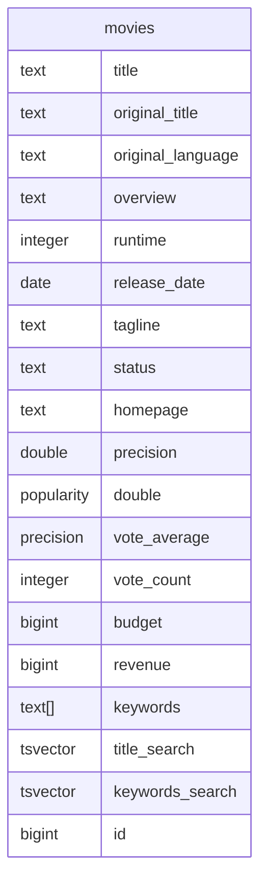

# sqlxgen

[](https://raw.githubusercontent.com/aakash-rajur/sqlxgen/main/LICENSE.md)

`sqlxgen` is a tool to generate sqlx compatible code from database schema and sql queries in your project.

1. Run [postgres query](https://github.com/aakash-rajur/sqlxgen/blob/main/internal/introspect/pg/model.sql) 
   or [mysql query](https://github.com/aakash-rajur/sqlxgen/blob/main/internal/introspect/mysql/model.sql) 
   to generate model code.
2. Run your query without selecting any rows to generate model code for the output and input structs.
3. support for postgres and mysql databases.

## Installation

### Install from source
```bash
# todo
```

## Usage

1. generate sqlxgen.yaml file in your project root directory with the following command.
```bash
sqlxgen init
```
2. edit `sqlxgen.yml` file to suit your needs. [example](example/sqlxgen.yml)
3. generate table model and query model code with the following command. Picks `sqlxgen.yml` from current directory.
```bash
sqlxgen generate [--config <path-to-config-file>]
```

## Example
example can be found [here](example)

following movies table generates [movies.gen.go](example/internal/tmdb_pg/models/movie.gen.go)

following query generates [get_actor.gen.go](example/internal/tmdb_pg/api/get_actor.gen.go)
```sql
select
a."id" as "id",
a."name" as "name",
coalesce(
  (
    select
    jsonb_agg(
      jsonb_build_object(
        'id', ma.movie_id,
        'title', m.title,
        'releaseDate', m.release_date,
        'character', ma.character
      ) order by m.release_date desc
    )
    from movies_actors ma
    inner join movies m on ma.movie_id = m.id
    where true
    and ma.actor_id = a.id
  ),
  '[]'
) as "movies"
from actors a
where a.id = :id; -- :id type: bigint
```

## Issues
1. `::` type casting is broken in sqlx
2. parameters are required to be annotated with typings `-- :param_name type: <param type>` as such,
```sql
select 
u.* 
from users u 
where true 
and id = :user_id; -- :user_id type: bigint
```
3. otherwise, they'll have `interface{}` type and will not be type safe.
4. json (`json` or `jsonb`) column selects required to annotated with `-- column: <column_name> json_type: <array | object>` as such,
```sql
select
u.id,
u.metadata -- column: metadata json_type: object
from users u
where true
and id = :user_id; -- :user_id type: bigint
```
5. otherwise, they'll have `json.RawMessage` type.
6. `json[b]_agg`, `json[b]_build_object`, `json_arrayagg`, `json_objectagg`, `json_object` and etc are taken care of [ref](internal/introspect/pg/json.go#L34)

## Motivation
1. age-old sql generation vs sql debate, i prefer writing sql queries over sql generation. (eat your greens!)
2. [sqlx](https://github.com/jmoiron/sqlx) expects provides excellent support for writing named queries and mapping query results to structs. Writing struct for each one of my tables and queries is tedious and error prone.
3. [sqlc](https://github.com/sqlc-dev/sqlc) generates models for table and queries but has the following challenges:
   1. dumps all generated code in a single place, not allowing me to organize my code more contextually. 
   2. does not introspect my queries through database unless I type cast my selects explicitly.
   3. introduces sqlc syntax for writing queries, which is not sql.

## Contributing
Pull requests are welcome. For major changes, please open an issue first to discuss what you would like to change.


## License
[MIT](LICENSE.md)
