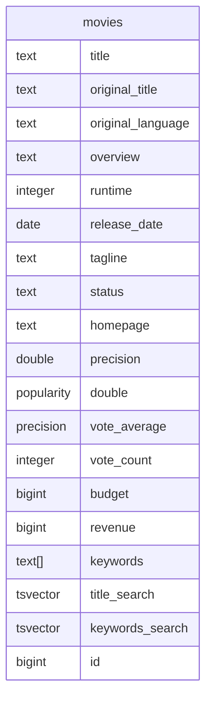

# sqlxgen

[](https://raw.githubusercontent.com/aakash-rajur/sqlxgen/main/LICENSE.md)

`sqlxgen` is a tool to generate sqlx compatible code from database schema and sql queries in your project.

1. Run [postgres query](https://github.com/aakash-rajur/sqlxgen/blob/main/internal/introspect/pg/model.sql) 
   or [mysql query](https://github.com/aakash-rajur/sqlxgen/blob/main/internal/introspect/mysql/model.sql) 
   to generate model code.
2. Run your query without selecting any rows to generate model code for the output and input structs.
3. support for postgres and mysql databases.

## Installation

### Install from source
```bash
# todo go install github.com/aakash-rajur/sqlxgen/cli
```

## Usage

1. generate sqlxgen.yaml file in your project root directory with the following command.
```bash
sqlxgen init
```
2. edit `sqlxgen.yaml` file to suit your needs.
3. generate table model and query model code with the following command. Picks `sqlxgen.yml` from current directory.
```bash
sqlxgen generate [--config <path-to-config-file>]
```

## Example
example can be found [here](example)

following movies table generates [movies.gen.go](example/internal/tmdb_pg/models/movie.gen.go)

following query generates [get_movies.gen.go](example/internal/tmdb_pg/api/get_movie.gen.go)
```sql
select
m."id" as "id",
m."title" as "title",
m."original_title" as "originalTitle",
m."original_language" as "originalLanguage",
m."overview" as "overview",
m."runtime" as "runtime",
m."release_date" as "releaseDate",
m."tagline" as "tagline",
m."status" as "status",
m."homepage" as "homepage",
m."popularity" as "popularity",
m."vote_average" as "voteAverage",
m."vote_count" as "voteCount",
m."budget" as "budget",
m."revenue" as "revenue",
m."keywords" as "keywords",
coalesce(
  (
    select
    jsonb_agg(
      jsonb_build_object(
        'id', g.genre_id,
        'name', hp.friendly_name
      ) order by hp.friendly_name
    )
    from movies_genres g
    inner join hyper_parameters hp on (
      true
      and hp.type = 'genre'
      and hp.value = g.genre_id
    )
    where true
    and g.movie_id = m.id
  ),
  '[]'
) as "genres",
coalesce(
  (
    select
    jsonb_agg(
      jsonb_build_object(
        'id', c.country_id,
        'name', hp.friendly_name
      ) order by hp.friendly_name
    )
    from movies_countries c
    inner join hyper_parameters hp on (
      true
      and hp.type = 'country'
      and hp.value = c.country_id
    )
    where true
    and c.movie_id = m.id
  ),
  '[]'
) as "countries",
coalesce(
  (
    select
    jsonb_agg(
      jsonb_build_object(
        'id', l.language_id,
        'name', hp.friendly_name
      ) order by hp.friendly_name
    )
    from movies_languages l
    inner join hyper_parameters hp on (
      true
      and hp.type = 'language'
      and hp.value = l.language_id
    )
    where true
    and l.movie_id = m.id
  ),
  '[]'
) as "languages",
coalesce(
  (
    select
    jsonb_agg(
      jsonb_build_object(
        'id', mc.company_id,
        'name', c.name
      ) order by c.name
    )
    from movies_companies mc
    inner join companies c on mc.company_id = c.id
    where true
    and mc.movie_id = m.id
  ),
  '[]'
) as "companies",
coalesce(
  (
    select
    jsonb_agg(
      jsonb_build_object(
        'id', ma.actor_id,
        'name', a.name,
        'character', ma.character,
        'order', ma.cast_order
      ) order by ma.cast_order
    )
    from movies_actors ma
    inner join actors a on ma.actor_id = a.id
    where true
    and ma.movie_id = m.id
  ),
  '[]'
) as "actors",
coalesce(
  (
    select
    jsonb_agg(
      jsonb_build_object(
        'id', mc.crew_id,
        'name', c.name,
        'job', j.friendly_name,
        'department', d.friendly_name
      ) order by j.friendly_name
    )
    from movies_crew mc
    inner join crew c on mc.crew_id = c.id
    inner join hyper_parameters d on (
      true
      and d.type = 'department'
      and d.value = mc.department_id
    )
    inner join hyper_parameters j on (
      true
      and j.type = 'job'
      and j.value = mc.job_id
    )
    where true
    and mc.movie_id = m.id
  ),
  '[]'
) as "crews"
from movies m
where true
and m.id = :id; -- :id type: bigint
```

## Issues
1. `::` type cast is broken in sqlx
2. parameters are required to be annotated with typings `-- :param_name type: <param type>` as such,
```sql
select 
u.* 
from users u 
where true 
and id = :user_id; -- :user_id type: bigint
```
3. otherwise, they'll have `interface{}` type and will not be type safe.
4. json (`json` or `jsonb`) selects required to annotated with `-- json_type: <array | object>` as such,
```sql
select
u.id,
u.metadata -- json_type: object
from users u
where true
and id = :user_id; -- :user_id type: bigint
```
5. otherwise, they'll have `json.RawMessage` type.

## Motivation
1. age-old sql generation vs sql debate, i prefer writing sql queries over sql generation. (eat your greens!)
2. [sqlx](https://github.com/jmoiron/sqlx) expects provides excellent support for writing named queries and mapping query results to structs. Writing struct for each one of my tables and queries is tedious and error prone.
3. [sqlc](https://github.com/sqlc-dev/sqlc) generates models for table and queries but has the following challenges:
   1. dumps all generated code in a single place, not allowing me to organize my code more contextually. 
   2. does not introspect my queries through database unless I type cast my selects explicitly.
   3. introduces sqlc syntax for writing queries, which is not sql.

## Contributing
Pull requests are welcome. For major changes, please open an issue first to discuss what you would like to change.


## License
[MIT](LICENSE.md)
